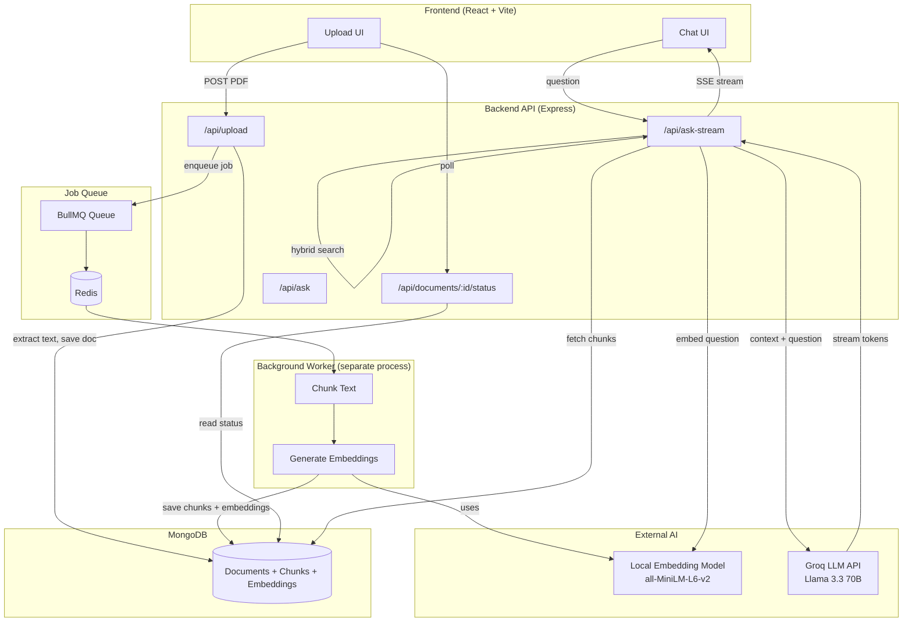
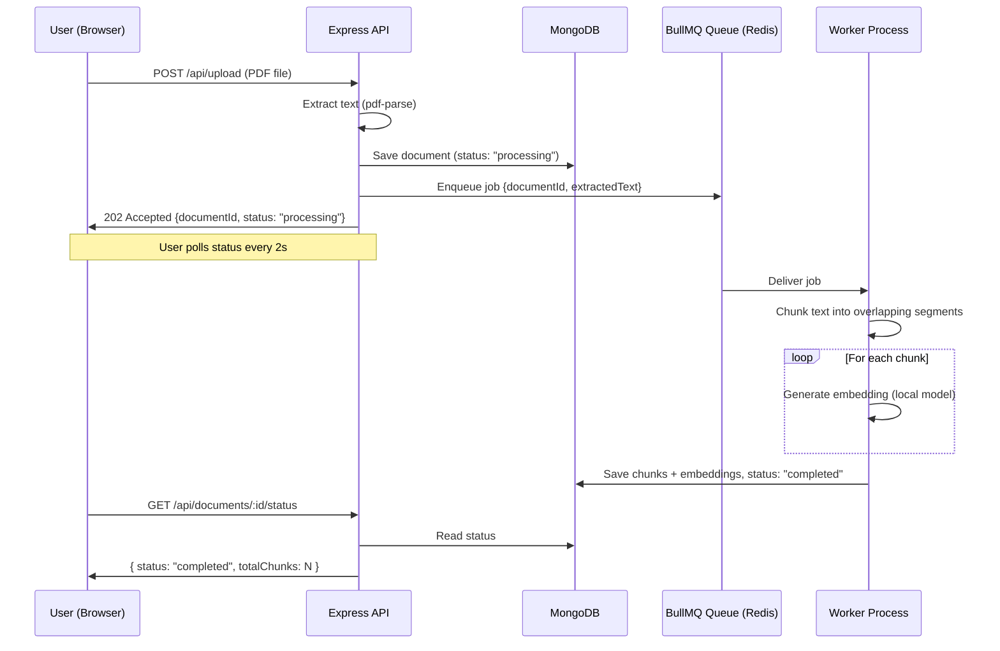
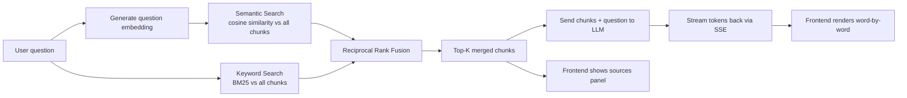

# 📄 DocMind — Hybrid RAG Document Q&A System

DocMind lets you upload a document (PDF) and ask natural-language questions about it. It answers using **only the content of that document**, streams the response token-by-token, and shows exactly which parts of the document it used to generate the answer.

Unlike most "chat with your PDF" tutorial projects, DocMind implements a **custom hybrid retrieval pipeline** (semantic + keyword search merged via Reciprocal Rank Fusion) and processes documents through a **background job queue** rather than blocking the request — the same architectural patterns used in production RAG systems.

---

## ✨ Features

- 📤 **PDF upload** with text extraction
- 🧠 **Local embeddings** (no external API cost or rate limits) using a Hugging Face transformer model
- 🔍 **Hybrid search**: combines semantic similarity search with BM25 keyword search, merged using Reciprocal Rank Fusion (RRF)
- 💬 **Real-time streaming answers** (Server-Sent Events) — tokens appear as they're generated, not all at once
- 📚 **Source citations** — every answer shows which document chunks it was grounded in, including each chunk's semantic rank, keyword rank, and combined RRF score
- ⚙️ **Background job processing** (BullMQ + Redis) — document processing doesn't block the API; a separate worker handles chunking and embedding generation
- 🗄️ **MongoDB** for both document storage and chunk/embedding storage

---

## 🏗️ Architecture Overview



---

## 🔄 Flow 1: Document Upload & Processing



---

## 🔄 Flow 2: Asking a Question (Hybrid Retrieval + Streaming)



### Why Hybrid Search?

Pure semantic search can miss exact terms (names, numbers, codes) because it matches on *meaning*, not exact words. Pure keyword search misses paraphrased or conceptually-related content. DocMind runs **both** independently, then merges the two ranked lists using **Reciprocal Rank Fusion**:

```
RRF_score(chunk) = 1/(k + semantic_rank) + 1/(k + keyword_rank)
```

A chunk that ranks highly in *either* method (or both) rises to the top — giving more robust retrieval than either method alone.

---

## 🧱 Tech Stack

| Layer | Technology |
|---|---|
| Frontend | React (Vite), Tailwind CSS, Framer Motion |
| Backend | Node.js, Express |
| Database | MongoDB (documents, chunks, embeddings) |
| Job Queue | BullMQ + Redis |
| Embeddings | `@xenova/transformers` — local `all-MiniLM-L6-v2` model (384-dim vectors) |
| LLM | Groq API — Llama 3.3 70B (streaming) |
| PDF Parsing | `pdf-parse` v2 |
| Retrieval | Custom cosine similarity + custom BM25 implementation + Reciprocal Rank Fusion |

---

## 📁 Folder Structure

```
docmind/
├── README.md
├── .gitignore
│
├── backend/
│   ├── package.json
│   ├── .env                          (not committed — see Setup)
│   ├── uploads/                      (temp storage, auto-cleared)
│   └── src/
│       ├── server.js                 # Express app entry point
│       ├── config/
│       │   ├── db.js                 # MongoDB connection
│       │   └── redisConnection.js    # Redis connection for BullMQ
│       ├── models/
│       │   └── Document.js           # Mongoose schema: document + chunks + embeddings
│       ├── routes/
│       │   ├── upload.js             # POST /upload, GET /documents/:id/status
│       │   └── ask.js                # POST /ask, POST /ask-stream
│       ├── queues/
│       │   └── documentQueue.js      # BullMQ queue definition
│       ├── workers/
│       │   └── documentWorker.js     # Background processor (separate process)
│       └── utils/
│           ├── chunker.js            # Text chunking logic
│           ├── embeddings.js         # Local embedding generation
│           ├── similarity.js         # Cosine similarity + semantic ranking
│           ├── keywordSearch.js      # BM25 keyword ranking
│           ├── rrf.js                # Reciprocal Rank Fusion
│           ├── hybridSearch.js       # Combines semantic + keyword via RRF
│           └── groqClient.js         # LLM API calls (normal + streaming)
│
└── frontend/
    ├── package.json
    ├── tailwind.config.js
    ├── postcss.config.js
    └── src/
        ├── App.jsx
        ├── index.css
        ├── api.js                    # Upload, polling, and SSE streaming helpers
        └── components/
            ├── UploadBox.jsx
            └── ChatBox.jsx
```

---

## ⚙️ Setup & Installation

### Prerequisites
- Node.js 18+
- MongoDB Atlas account (free tier works)
- Redis (installed locally via Homebrew, or Docker)
- A free [Groq API key](https://console.groq.com)

### 1. Clone and install
```bash
git clone <your-repo-url>
cd docmind

cd backend && npm install
cd ../frontend && npm install
```

### 2. Environment variables
Create `backend/.env`:
```
MONGODB_URI=your_mongodb_atlas_connection_string
PORT=5001
GROQ_API_KEY=your_groq_api_key
```

### 3. Start Redis
```bash
brew install redis        # one-time
brew services start redis
```

### 4. Run all three processes (separate terminals)
```bash
# Terminal 1 — backend API
cd backend && npm run dev

# Terminal 2 — background worker
cd backend && npm run worker

# Terminal 3 — frontend
cd frontend && npm run dev
```

Visit `http://localhost:5173`.

---

## 🔌 API Reference

| Method | Endpoint | Description |
|---|---|---|
| `POST` | `/api/upload` | Upload a PDF (`multipart/form-data`, field name `file`). Returns immediately with `documentId`, processing happens in background. |
| `GET` | `/api/documents/:id/status` | Check processing status (`processing` \| `completed` \| `failed`) |
| `POST` | `/api/ask` | Ask a question. Body: `{ documentId, question }`. Returns full answer + sources (non-streaming). |
| `POST` | `/api/ask-stream` | Same as above, but streams the answer via Server-Sent Events. |

---

## 🚧 Known Limitations & Future Improvements

- **Whole-document summarization is weak.** Because retrieval pulls the top-K chunks most relevant to a *specific* question, broad questions like "summarize this document" or "what topics does this cover" don't map well to any single chunk and can return low-confidence answers. A proper fix would require intent detection to route summarization-style questions to a separate "feed the whole document" path instead of chunk retrieval.
- **Single document at a time.** Currently scoped to asking questions about one uploaded document per session — multi-document search across a whole library would need a document-selection layer.
- **No conversation memory.** Each question is independent; there's no multi-turn context carried between questions yet.
- **Relevance scores are not perfectly calibrated.** Cosine similarity scores from the local MiniLM model trend lower (0.1–0.6) even for genuinely good matches — ranking is reliable, but absolute scores aren't directly comparable to, say, OpenAI embedding scores.

---

## 🎯 Why This Project Exists

Most "RAG chatbot" portfolio projects wrap a single library call (e.g., LangChain + Pinecone) around a chat UI. DocMind was built specifically to demonstrate the *underlying mechanics* of retrieval-augmented generation by hand:

- Custom **chunking** logic instead of default character-splitting
- A from-scratch **BM25** implementation rather than calling a search engine
- **Reciprocal Rank Fusion** to combine two genuinely different ranking signals
- **Background job processing** so the API never blocks on slow embedding work
- **Real token streaming** via manually-parsed Server-Sent Events, not a simulated typing effect